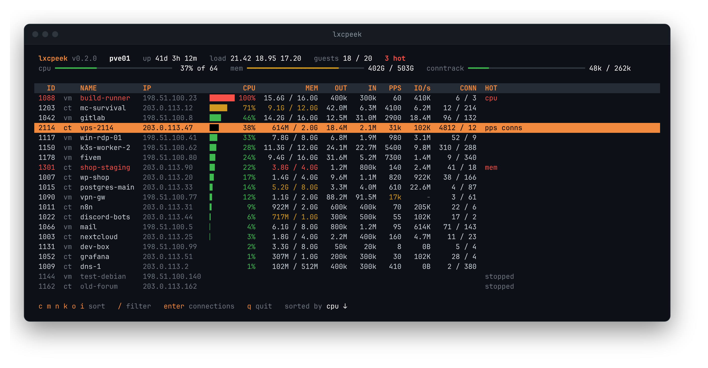
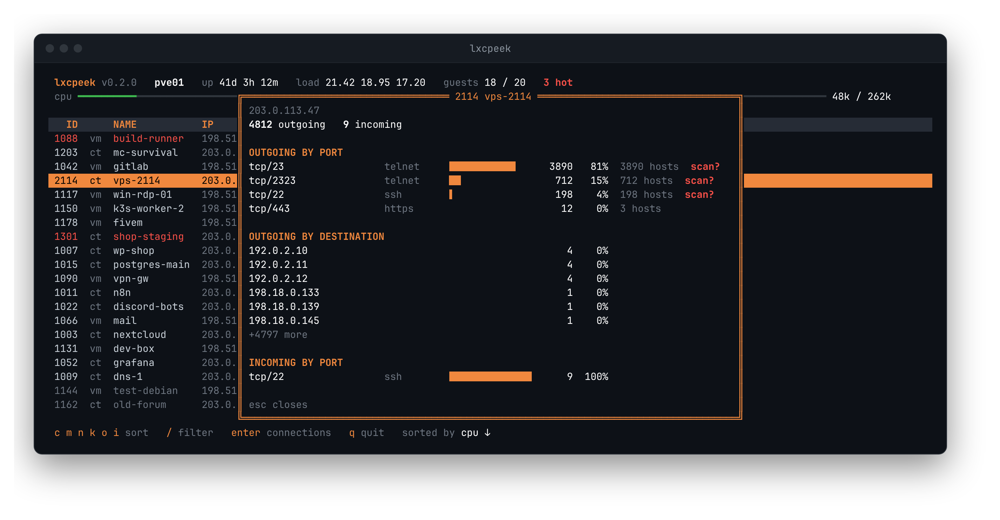
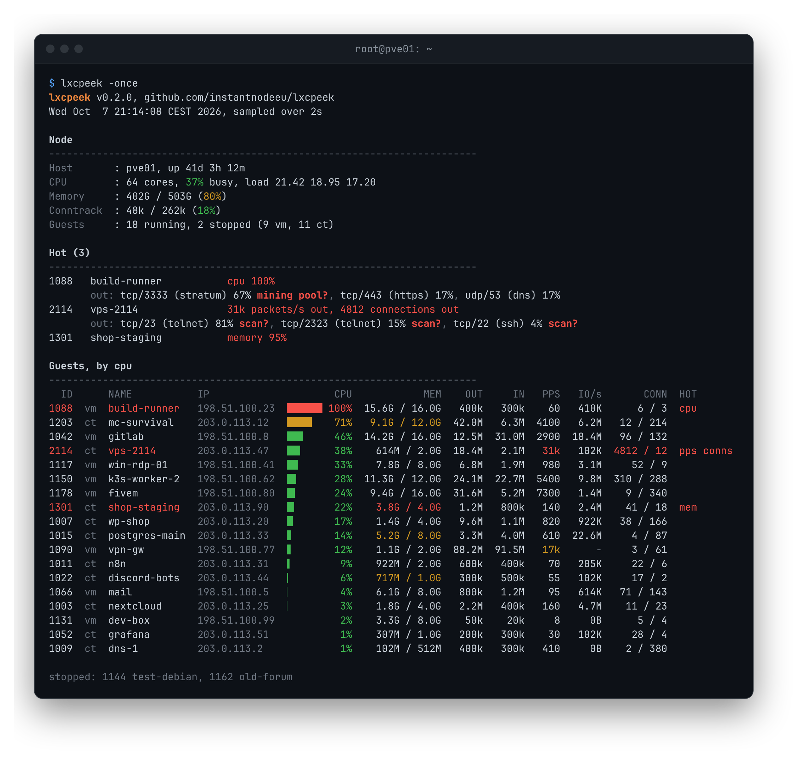

<p align="center"></p>

<p align="center">
  
  
  
  <a href="https://github.com/instantnodeeu/lxcpeek/releases"></a>
  <a href="https://github.com/instantnodeeu/lxcpeek/stargazers"></a>
  <a href="https://github.com/instantnodeeu/lxcpeek/actions"></a>
  <a href="https://instantnode.eu"></a>
</p>

top for the guests on a Proxmox VE node. One table with every container
and VM: CPU, memory, network in bit/s and packets/s, disk IO and how many
connections each guest has open. Guests that look wrong are painted red.

We host a lot of customer guests and the question at 3am is always the
same: *which one is it?* The miner pinning 16 cores, the box scanning port
23 across the internet, the one filling the conntrack table. The PVE web UI
can tell you, one guest at a time. lxcpeek tells you in one screen.

<p align="center"></p>

- **CPU** as a percentage of what the guest is allowed to use, so a 2 core
  container at 100% stands out even on a 64 core host
- **Memory** working set against the limit
- **Network** out/in in bit/s and outgoing packets/s, seen from the guest
- **Disk IO** read + write per second
- **Connections** outgoing/incoming per guest from the conntrack table, plus
  the host's conntrack fill level in the header
- **Enter** on a guest shows where it connects to: top ports, top
  destinations, top incoming ports, and a guess when it looks like a port
  scan, outgoing spam or a mining pool

<p align="center"></p>

A guest is marked hot when CPU (or memory, containers only) is at 90% of
its allotment, it sends more than 20k packets/s or has more than 1000
outgoing connections. VM memory is never flagged: QEMU keeps every page the
guest ever touched, so from the host almost every VM looks full.

## Report

`lxcpeek -once` samples for two seconds and prints a report instead of the
TUI: the node, the hot guests with the reason and where they connect to,
then every guest.

<p align="center"></p>

Colors go away when the output is not a terminal or `NO_COLOR` is set, so
it pastes cleanly into a ticket or an abuse report.

`-hot` only prints the node and the hot guests and exits with status 2 if
there are any. That is enough for a cron job:

```sh
*/5 * * * * /usr/local/bin/lxcpeek -once -hot > /tmp/hot.txt || mail -s "hot guests on $(hostname)" ops@example.com < /tmp/hot.txt
```

`-json` gives the same data for scripts:

```sh
lxcpeek -once -json | jq -r '.guests[] | select(.hot) | "\(.id) \(.name) \(.hot)"'
```

## How it works

No agent in the guests, no API token, no config. It reads what the host
already has:

| | |
|---|---|
| guests, names, limits, IPs | `/etc/pve/lxc/*.conf`, `/etc/pve/qemu-server/*.conf`, ipfilter ipsets in `/etc/pve/firewall/<id>.fw` |
| CPU, memory, IO | cgroup v2, `/sys/fs/cgroup/lxc/<id>` and `qemu.slice/<id>.scope`; VM disk IO from `/proc/<qemu pid>/io` |
| network | host side ports `veth<id>i<n>` and `tap<id>i<n>` |
| connections | `/proc/net/nf_conntrack`, or `conntrack -L` if the kernel has no procfs file |

Connections are matched by guest IP, so a VM without cloud-init needs its
IP in an ipfilter ipset (which you want anyway against IP spoofing).
Connection counts only show traffic that passes conntrack, which on PVE means
the firewall has to be enabled for the guest.

The scan/spam/mining guesses are simple: more than 100 different hosts on
one port that is not web or DNS looks like a scan, more than 50 mail servers
looks like spam, and a few well known stratum ports look like a pool. They
are hints for where to look, not proof.

## Install

On the PVE node:

```sh
curl -Lo lxcpeek https://github.com/instantnodeeu/lxcpeek/releases/latest/download/lxcpeek-linux-amd64
chmod +x lxcpeek
mv lxcpeek /usr/local/bin/
```

Or with Go 1.24+:

```sh
go install github.com/instantnodeeu/lxcpeek@latest
```

## Usage

```sh
lxcpeek                 # TUI, refresh every 2s
lxcpeek -d 5s           # slower, nicer on a full conntrack table
lxcpeek -once           # report
lxcpeek -once -hot      # only hot guests, exit status 2 if there are any
lxcpeek -once -json     # for scripts and alerting
```

Run it as root. `/etc/pve` and the conntrack table are not readable
otherwise.

## Keys

| Key | |
|---|---|
| `c` `m` `n` `k` `o` `i` | sort by CPU, memory, network, connections, disk IO, ID (again to reverse) |
| `/` | filter, `Esc` clears |
| `Enter` | connections of the selected guest |
| `q` | quit |

## Build

```sh
make          # ./lxcpeek
make test
make dist     # static linux amd64 + arm64 in dist/
```

The screenshots are made up guests on documentation IP ranges, not a real
node.

## License

MIT
